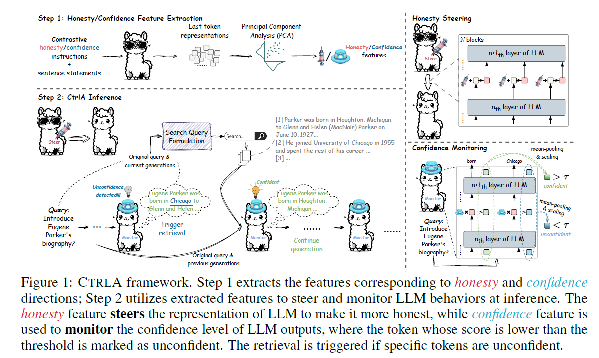

<div align="center">
    
</div>
<div align="center">
<p align="center">
    <a href="https://www.python.org/">
            
    </a>
    <a href="https://github.com/HSLiu-Initial/CtrlA/blob/main/LICENSE">
            
    </a>
    <a href="https://github.com/HSLiu-Initial/CtrlA">
            
    </a>
    </p>
</p>
</div>


# CtrlA: Adaptive RAG via Probe-Guided Control

<p align="center">
📘 <a href="https://zhuanlan.zhihu.com/p/708644813" target="_blank">Zhihu Blog</a> • 📝 <a href="https://arxiv.org/abs/2405.18727" target="_blank"> Arxiv Paper </a><br>
</p>

The official implementation of **CtrlA: Adaptive Retrieval-Augmented Generation via Probe-Guided Control**.



CtrlA introduces an effective probe-guided adaptive RAG framework, termed CtrlA, to enhance retrieval-augmented generation for LLM, balancing its internal and external knowledge. CtrlA characterizes LLM’s internal states and intervenes in the LLM generation from two perspectives: honesty control and confidence monitoring via simple yet effective probes.

## :syringe: Installation

Install dependencies by running the command below.
```
pip install -r requirements.txt
```

## :syringe: Datasets and Model

The dataset used for training the Confidence and Honesty Probes, as well as for our evaluation, is available [here](https://drive.google.com/drive/folders/1DlIDkYvo1C_d5Nb8j589Jv7Hhe5Guk9T?usp=sharing). Please create an `eval_data/` directory and place all the data files within it.

Please download the model file from [mistralai/Mistral-7B-Instruct-v0.1 on Hugging Face](https://huggingface.co/mistralai/Mistral-7B-Instruct-v0.1) and place it in the `model/` directory.

## :syringe: Confidence and Honesty Probe

The pre-trained probes are stored in the `trained_probe/` directory.

To train the probes, refer to the `train_confidence_probe.ipynb` notebook for the confidence probe, and the `train_honesty_probe.ipynb` notebook for the honesty probe.

## :syringe: Retriever Setup

All the code related to the retriever setup is in the `code/retrievers` directory. We provide two retrieval services
as reported in our paper:

1. **BM25** Retrieval Service using ElasticSearch
2. **BGE** Retrieval Service using FAISS

### :syringe: Downloads

1. Wikipedia 2018 Snippets: `wget https://dl.fbaipublicfiles.com/dpr/wikipedia_split/psgs_w100.tsv.gz`
2. BGE Embedding Model Weights: `https://huggingface.co/BAAI/bge-large-en-v1.5`

### :syringe: Retriever Dependencies

- FAISS : `https://github.com/facebookresearch/faiss` or `https://pypi.org/project/faiss/`
- SentenceTransformers: `https://github.com/UKPLab/sentence-transformers`
- Flask
- PyTorch
- ElasticSearch

### :syringe: Quick Start to Setup **BGE** Retrieval Service

```bash
cd code/retrievers/bge_retrieval_service  # go to the target directory
python encode_wiki_bge.py  # encode snippets into embeddings
python bge_faiss.py  # set up bge-retrieval service
```

The sample code to call the bge-retrieval service: 
```bash
python send_req_bge_wiki.py -q <query> -k <stop_k> --use_prefix
```
`--use_prefix` is optional, which appends the prefix `Represent this sentence for searching relevant passages:` in front of queries for asymmetric encoding of queries and passages

### :syringe: Quick Start to Setup ES (Elasticsearch) Retrieval Service (**BM25**)
```bash
cd code/retrievers/es_retrieval_service  # go to the target directory
python es_dictionary.py  # convert passages in tsv to desired dictionary format.
python es_service.py  # set up Elasticsearch Retrieval Service
```

The sample code to call the es-retrieval service: 
```bash
python send_es_req.py -q <query> -k <stop_k>
```

After deploying the retrieval service, please complete the corresponding retrieval functions in `code/retrieval.py`.

## :syringe: Evaluation

All the commands can be found in `./run.sh`

### :syringe: TriviaQA
```bash
python run.py --config configs/run.json --model run_short_form --dataset triviaqa --task triviaqa --max_new_tokens 1024 --retrieve_method bge_serper --metric match --use_tvq
```

### :syringe: PopQA
```bash
python run.py --config configs/run.json --model run_short_form --dataset popqa --task popqa --max_new_tokens 1024 --retrieve_method bge_serper --metric match --use_tvq --continue_gen_without_contents
```

### :syringe: ASQA
```bash
python run.py --config configs/run.json --model run_long_form --dataset asqa --task asqa --max_new_tokens 130 --retrieve_method bge --use_tvq
```
[ALCE/ASQA](https://github.com/princeton-nlp/ALCE) offers a thorough evaluation of long-form QA using various metrics. To conduct the initial evaluation, you can install the ALCE repository and download the necessary data.
```bash
git clone https://github.com/princeton-nlp/ALCE.git
python3 -m alce_env
cd ALCE
bash download_data.sh
```

### :syringe: Bio Generation
```bash
python run.py --config configs/run.json --model run_long_form --dataset fact --task fact --max_new_tokens 300 --retrieve_method bge_serper --use_tvq
```
Please follow the instructions in the [FactScore](https://github.com/shmsw25/FActScore) official repository to set up your environment. Since the original repository is no longer maintained, consider using alternative sources like [wj210's fork](https://github.com/wj210/factscore) or [armingh2000's FactScoreLite](https://github.com/armingh2000/FactScoreLite) for evaluations. To proceed, use the command below:
```bash
python -m factscore.factscorer --data_path <output_file>  --model_name retrieval+ChatGPT --cache_dir <cache_dir> --openai_key <openai_key> --verbose
```

### :syringe: FreshQA
```bash
python run.py --config configs/run.json --model run_long_form --dataset fresh --task fresh --max_new_tokens 1024 --retrieve_method serper --use_tvq
```
Please follow the instructions provided in the [freshllms/freshqa](https://github.com/freshllms/freshqa) repository, which includes complete data and codes of [FreshLLMs](https://arxiv.org/abs/2310.03214), to conduct your evaluation.

## :syringe: Citation
If this work is helpful for you, please kindly cite it as follows:
```bibtex
@misc{liu2024ctrla,
      title={CtrlA: Adaptive Retrieval-Augmented Generation via Probe-Guided Control}, 
      author={Huanshuo Liu and Hao Zhang and Zhijiang Guo and Kuicai Dong and Xiangyang Li and Yi Quan Lee and Cong Zhang and Yong Liu},
      year={2024},
      eprint={2405.18727},
      archivePrefix={arXiv},
      primaryClass={cs.CL}
}
```

## :syringe: Contact

If you have questions, feel free to send an email to huanshuo.liu[at]u.nus.edu.
